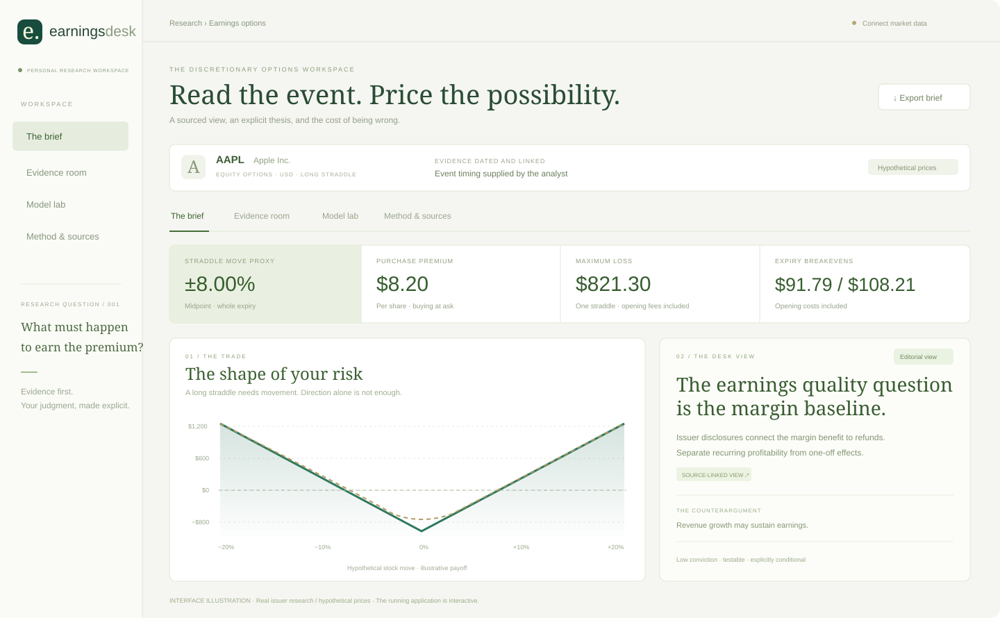

# Earnings Desk

### Read the event. Price the possibility.

A research workspace for discretionary options traders: real issuer evidence, a conditional investment view, and transparent hypothetical earnings trades. Built with **React · shadcn/ui · Recharts · FastAPI · EdgarTools · Docling · Pydantic AI · Promptfoo**.



*Interface illustration, not a browser screenshot. The running application has interactive charts and editable inputs. The $100 reference price and option quotes shown above are hypothetical.*

## What you can do

| Workflow | Finished result |
| --- | --- |
| Read the desk view | A sourced Apple thesis, counterargument, and observable invalidation |
| Connect market data | A dated option pair from MarketData.app, with bid/ask and freshness checks |
| Model a hypothetical trade | Ask-based entry, opening fees, maximum loss, breakevens and expiry payoff |
| Stress the event | Post-event valuation across stock moves and assumed IV reductions |
| Inspect the evidence | Source links, publication dates, filing excerpts and document hashes |
| Generate an AI view | Schema-validated opinion with checked citation IDs and measured token usage |
| Export and compare | A frozen JSON snapshot; identical input pack for model experiments |

## Start locally

Requirements: Python 3.12, [uv](https://docs.astral.sh/uv/), Node 22.12 or newer.

```bash
uv sync --extra dev
cd frontend
npm ci
npm run build
cd ..
uv run uvicorn app.main:app --host 127.0.0.1 --port 8001
```

Open **http://127.0.0.1:8001**. No credentials are needed to explore the sourced Apple pack with hypothetical prices. Interactive API docs: http://127.0.0.1:8001/docs.

For frontend development, run `npm run dev` inside `frontend` while the API runs on port 8001. Vite proxies API requests locally.

## Connect the free data provider

Create an account at [MarketData.app](https://www.marketdata.app/pricing/), obtain an API token, and put it in the root `.env` using [.env.example](.env.example) as the template:

```dotenv
MARKETDATA_TOKEN=your_token_here
ALPHA_VANTAGE_API_KEY=your_key_here
```

Restart the API. Select **MarketData.app · delayed**, specify an event and a listed expiration, then click **Fetch quotes & build**. The app requests one expiry and the nearest strike, and caches the response for 15 minutes. It never substitutes example prices when a real request fails. When configured, click **Lookup calendar** next to the event date to check scheduled reporting dates and view historical quarterly EPS surprises from Alpha Vantage (cached 6 hours locally).

**Free does not mean real-time.** As verified October 1, 2026, the provider lists 100 daily credits, one year of history, and 24h+ delayed options on Free Forever. Its no-card trial increases credits but still has 24h+ delayed prices. Quotes remain timestamped. See the [pricing page](https://www.marketdata.app/pricing/) and [trial terms](https://www.marketdata.app/docs/account/plans/starter-trial/) for current entitlements.

Individual plans are for internal use. Keep real quote exports local; a public hosted demo should use hypothetical prices unless you obtain redistribution rights. Authenticated AAPL retrieval was verified through the application on October 1, 2026, including timestamps, IV, payoff bounds and cache reuse. New users must configure their own accounts.

## Add research and AI

Set `EDGAR_IDENTITY` to your real contact identity to fetch the latest 10-Q/10-K through EdgarTools. The evidence room can also upload UTF-8 text or Markdown. For PDF extraction:

```bash
uv sync --extra dev --extra documents
```

Docling parses text-based PDFs locally. Initial model assets may need downloading; OCR is disabled in this configuration. The application limits uploads to 8 MB and retains bounded excerpts with content hashes. Documents and snapshots are held in bounded in-memory stores; export before restarting.

DeepSeek Flash is the default inexpensive opinion model. Set its key:

```dotenv
AI_MODEL=deepseek:deepseek-flash
DEEPSEEK_API_KEY=
```

OpenAI and Anthropic keys remain optional for the comparative experiment. The running application does not require them.

Click **Generate AI view** to make a model call. Browsing or recalculating makes no paid model calls. Inputs include your thesis and attached evidence. Numbers in the charts come from Python. Model prose is checked for schema and citation IDs, but factual support and numeric claims still require review.

## How it works


The saved snapshot contains the market observation, assumptions, source evidence, calculation outputs and hashes. Opinions are generated against that saved snapshot. Editing inputs marks charts as pending until recalculation, and rebuilding clears the previous model opinion.

The initial Apple opinion is **authored editorial analysis**, not a completed model run. No claim of cheap/rich volatility is made without historical and expectation data.

## Test and experiment

```bash
uv run ruff check app tests evals
uv run pytest
cd frontend && npm test && npm run build
```

The 43 backend tests cover quote validation, stale/crossed quotes, future timestamps, expiry/event ordering, IV recovery, downside bounds, missing credentials, document provenance, citation rejection, Alpha Vantage calendar and EPS surprise parsing, rate limit handling, cache TTL, and Pydantic AI structured outputs using its test model. Six frontend DOM tests cover initial labels, pending edits, evidence navigation, provider errors, calendar lookup, and quarterly EPS surprises; chart rendering is stubbed in these tests and is not a substitute for visual browser QA.

For the weekly experiment, export a single snapshot and run all configured models against it:

```bash
uv run python -m evals.export_pack
cd evals
npm ci
# The runner uses the project's .venv Python automatically.
npm run compare
```

For a DeepSeek-only run, set `EVAL_DEEPSEEK_MODEL=deepseek-flash`. The full three-provider comparison additionally needs the OpenAI and Anthropic model identifiers and keys. See [the experiment protocol](evals/README.md). Automated checks cover schema, citations, missing evidence and an injected source instruction; human review scores source support, numeric fidelity and financial judgment. **Provider benchmarks have not been run.** Dollar costs are not estimated; tokens and latency are recorded when calls complete.

## Current boundaries

- Authenticated AAPL market-data retrieval and Apple SEC filing retrieval are verified through the running application. Other tickers and provider entitlements still require their own checks.
- The curated real evidence pack currently covers AAPL. Other tickers need uploaded or SEC evidence.
- Earnings dates default to user assumptions unless confirmed via Alpha Vantage calendar lookup (free tier: 25 req/day, 5 req/min, 6-hour local cache); calendar dates remain indicative and subject to IR confirmation.
- No historical earnings-move distribution, consensus service or event-variance decomposition is attached.
- Post-event valuations use a European Black–Scholes approximation, constant dividend yield and user-selected IV reduction. American early exercise and discrete dividends are excluded.
- Opening fees and purchase asks are included. Hypothetical exit valuations omit liquidation spreads and exit fees.
- Reaction dates roll weekends, not exchange holidays or early closes.
- The service is a single-user local prototype, without authentication or public deployment. Browser visual QA was blocked by the local computer-use service; the frontend build and API checks are independently verified.

## Repository map

```text
app/          API, quote provider, research ingestion, risk engine, agent
frontend/     React + shadcn/ui + Recharts
app/data/     Curated issuer evidence; legacy synthetic case
tests/        Numerical, provider-contract, API and agent tests
evals/        Frozen-pack export and Promptfoo comparison
docs/         Strategy, methodology and visual assets
```

[Build strategy](docs/build-strategy.md) · [Methodology and architecture](docs/architecture.md) · [Data and configuration](docs/data-sources.md) · [Attribution](THIRD_PARTY_NOTICES.md)

Original contribution: the earnings workflow, pricing conventions, quality checks, research presentation and evaluation harness. Dexter and OpenBB informed research/workspace design; their code is not embedded.
