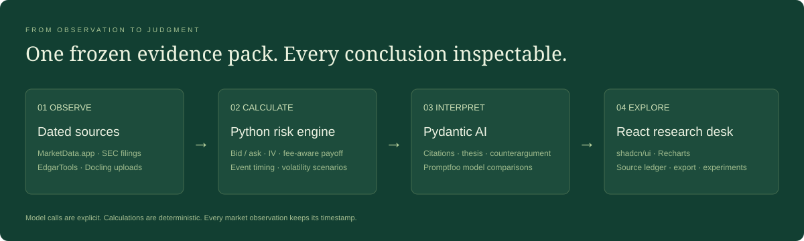

# Architecture and methodology

## System boundaries

React sends a typed scenario request to FastAPI. The market adapter returns either explicitly hypothetical inputs or a timestamped MarketData.app chain. Quote validation rejects crossed/zero bids, mismatched underlyings, adjusted OCC roots and leg timestamps separated by over 15 minutes. Actual provider responses are cached for 15 minutes; original fetch times are retained.

The Python risk engine derives separate call and put IVs from midpoints by bounded bisection. It prices the entry at both asks, plus opening fees. Expiry P&L uses intrinsic values. Post-event P&L assumes selling at European model values with user-chosen IV reduction. A 100-share standard contract multiplier is assumed; adjusted roots are excluded.

The source ledger combines curated issuer summaries, EdgarTools filing excerpts and Docling/text uploads. Sources published after the market snapshot are rejected or excluded to prevent hindsight contamination. SEC excerpt selection is keyword-based and can miss relevant material; users should inspect the full filing.

Snapshot hashes identify the actual input/output bundle, and evidence hashes identify the research pack. Snapshots and document contents live in bounded process memory, not a permanent database. Export is the persistence mechanism. The current export records a model run in the browser download but does not update the original frozen snapshot.

Pydantic AI receives an existing snapshot only on an explicit POST. The output schema includes stance, cited rationale, counterargument, invalidation and open questions. A validator rejects unknown citation IDs with one retry. This checks reference integrity, not entailment. The model still needs content evaluation.

## Numerical conventions

- Midpoint proxy = (call bid + call ask + put bid + put ask) / 2 / spot.
- Entry debit = call ask + put ask + 2 × fee per contract / 100.
- Expiry payoff = absolute difference between terminal spot and common strike.
- Dollar P&L = (payoff − entry debit) × 100 × number of straddles.
- Expiry breakevens = strike ± entry debit, with no feasible lower breakeven if the lower result is nonpositive.
- Post-event volatility = solved pre-event IV × (1 − assumed reduction).
- Rate and continuous dividend yield are user assumptions, not fetched market observations.
- Calendar uses America/New_York; assumed reaction is the next weekday's 09:30 after an after-close announcement, or same-day 09:30 before-open. Exchange holidays require user review.
- Stale flag uses 36 elapsed hours. A weekend observation can be correctly delayed yet flagged stale; never relabel it current.

## Local API

| Endpoint | Purpose |
| --- | --- |
| GET /api/desk/initial | Real AAPL research plus hypothetical prices; no paid call |
| GET /api/desk/status | Credential-presence flags only, never secrets |
| POST /api/desk/brief | Validate, fetch or model, calculate, freeze snapshot |
| GET /api/desk/snapshots/{id} | Export original snapshot |
| POST /api/desk/snapshots/{id}/opinion | Explicit model request |
| POST /api/desk/documents | Extract local document and return attachment ID |
| POST /api/desk/filings/{ticker} | Retrieve latest 10-Q/10-K via EdgarTools |
| GET /api/desk/earnings/{ticker} | Upcoming calendar event & EPS history via Alpha Vantage |

The legacy synthetic ACME example remains at /legacy and /api/brief/ACME, entirely deterministic.

## Deployment boundary

Bind to loopback for local use. Public deployment needs authentication, request/body budgets, persistent storage and market-data redistribution permission. API keys stay server-side. Uploaded documents are untrusted data; instruction separation and citation checks reduce risk but are not a complete injection defense. The model call sends selected evidence to the configured model provider.
